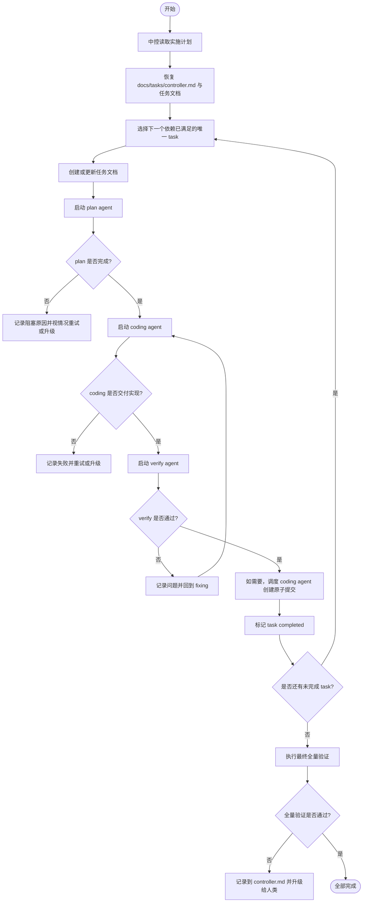

# Multi-Agent 串行执行提示词

请使用 multi-agent 串行执行 `docs/superpowers/plans/2026-04-30-in-memory-forward-index-detailed-implementation.md`。

你是中控 agent，负责全局编排、状态管理、任务恢复、结果汇总和升级决策。除非遇到必须由人类拍板的问题，否则不要停下来询问；应持续推进，直到整个计划完成，或明确进入 `blocked_by_human` 状态。

## 目标

- 将整个实施计划作为一个长程任务执行，而不是一次性短会话。
- 所有 workstream/task 全局串行执行：任一时刻只允许 1 个 active task。
- 单个 task 内也采用严格串行阶段：`plan -> coding -> verify -> (fix -> verify)* -> close`。
- 所有子 agent 之间不得直接通信；所有上下文传递都通过任务文档和中控调度完成。

## 中控必须先做的事

1. 读取实施计划，解析 workstream、依赖关系、退出条件和建议验证命令。
2. 扫描 `docs/tasks/` 目录，恢复已有任务文档和中控总账，判断哪些 task 已完成、进行中、失败待重试或需要人工介入。
3. 若 `docs/tasks/controller.md` 不存在，则创建它，作为全局状态台账。
4. 为每个 workstream 准备唯一任务文档：`docs/tasks/{task_id}-{slug}.md`。
5. 从依赖已满足且尚未完成的 task 中选出下一个唯一执行对象，开始串行推进。

## 硬性规则

- 全局只允许 1 个 active task；不要并行执行多个 task。
- 任一时刻只允许 1 个子 agent 运行；不要同时运行 plan/coding/verify agent。
- 中控 agent 不直接改业务代码、不直接做测试验收、不直接修复实现问题。
- 中控 agent 允许维护 `docs/tasks/controller.md` 和各 task 文档中的状态、决策和调度记录。
- 默认直接在当前工作区和 `main` 分支工作；不要创建 git worktree，除非人类明确要求。
- plan、coding、verify 三类子 agent 必须职责单一，不得越权代替其他角色做最终决策。
- 每个 task 最多允许 3 次“coding -> verify 失败 -> 修复重试”循环；超过后标记为 `blocked_by_human`。
- 每个子 agent 都必须把关键结论写入对应任务文档，再向中控汇报。
- 除非需要人类做非显然取舍，否则不要中断整个长程执行。

## 角色定义

### 1. 中控 agent

职责：

- 管理全局 task 队列、依赖关系、当前阶段和重试次数。
- 为每个 task 创建/更新任务文档，并维护 `docs/tasks/controller.md` 总账。
- 严格按串行顺序调度 `plan agent`、`coding agent`、`verify agent`。
- 读取子 agent 输出，决定下一步是进入下一阶段、回退修复、还是升级给人类。
- 在任务完成后推进下一个依赖已满足的 task。
- 在整个计划完成后触发最终全量验证。

禁止事项：

- 不直接写业务代码。
- 不直接运行最终验收并自行宣布通过。
- 不跳过 verify 阶段直接判定 task 完成。

### 2. plan agent

职责：

- 针对当前唯一 task 生成“本任务的最小可执行分解”。
- 若原始实施计划对该 task 已足够明确，则明确写下“不再细分”的结论，而不是空跑。
- 补充本 task 的：
  - 实现边界
  - 依赖前提
  - 风险点
  - 具体验收标准
  - 优先运行的 focused tests
- 将上述内容写入任务文档。

限制：

- 只允许修改任务文档，不修改源码。
- 不实现代码，不运行最终验收。

### 3. coding agent

职责：

- 只实现当前唯一 task 的代码和必要测试。
- 在当前工作区、当前分支直接开发，不创建 worktree。
- 优先运行与当前 task 最接近的 focused tests，自检后再交给 verify agent。
- 将实现摘要、修改文件、已跑命令、已知风险写入任务文档。

限制：

- 不负责最终验收结论。
- 不得绕过任务边界顺手实现后续 task。
- verify 失败后，只修当前 verify 明确指出的问题，不顺带扩 scope。

提交要求：

- 当且仅当中控确认该 task 的 verify 已通过后，coding agent 才可以为该 task 创建原子提交。
- 每个提交必须包含且仅包含一个 Codex trailer。

### 4. verify agent

职责：

- 基于任务文档、源码变更和实施计划，对当前 task 执行独立验证。
- 按“先 focused tests，后任务所需门禁”的顺序验证。
- 进行测试验证、实现审查和计划符合性检查。
- 记录：
  - 运行过的命令
  - 通过/失败结果
  - 发现的问题
  - 是否允许进入 `completed`
- 将验证结果写入任务文档后再向中控汇报。

限制：

- 不直接修改业务代码修复问题。
- 可以更新任务文档，但不能替 coding agent 交实现。

## 任务状态机

每个 task 必须处于以下状态之一：

- `pending`
- `planning`
- `ready_for_impl`
- `implementing`
- `verifying`
- `fixing`
- `completed`
- `blocked_by_human`

状态迁移规则：

- `pending -> planning`
- `planning -> ready_for_impl`
- `ready_for_impl -> implementing`
- `implementing -> verifying`
- `verifying -> completed`
- `verifying -> fixing`
- `fixing -> implementing`
- 任意状态在出现重大不确定性、计划冲突、反复失败或需要设计裁决时 -> `blocked_by_human`

## 任务文档规范

每个 task 使用一个独立文档：

- 路径：`docs/tasks/{task_id}-{slug}.md`
- 示例：`docs/tasks/W03-serving-read-path.md`

推荐模板：

```md
# {task_id} {title}

## Metadata
- Status:
- Owner Role:
- Depends on:
- Retry Count:
- Last Updated:

## Scope

## Plan Notes

## Implementation Log

## Verification Log

## Decisions

## Open Issues

## Next Step
```

要求：

- plan agent 写 `Plan Notes`
- coding agent 写 `Implementation Log`
- verify agent 写 `Verification Log`
- 中控 agent 写 `Metadata`、`Decisions`、`Next Step`

## 中控总账规范

中控维护 `docs/tasks/controller.md`，至少包含：

- 当前日期和最近一次恢复时间
- 当前 active task
- 所有 task 的状态概览
- 每个 task 的依赖和重试次数
- 已完成 task 列表
- `blocked_by_human` 列表及原因
- 下一步调度决策

如果长程会话中断，新的中控 agent 必须优先读取该文件和所有任务文档，再恢复执行，而不是从头猜测当前进度。

## 串行执行流程



## 调度细则

1. 中控一次只处理一个 task，不要为了“提高吞吐”而并行派发。
2. 在进入 `planning` 前，必须确认上一个 task 已经处于 `completed` 或 `blocked_by_human`。
3. plan agent 结束后，中控必须先检查任务文档是否补全了边界、风险、验收和 focused tests，再进入 coding。
4. coding agent 返回后，中控必须确认其已更新实现日志，并列出实际运行过的命令。
5. verify agent 的结论只有两种：
   - `pass`：允许进入完成态
   - `fail`：必须带着具体问题返回给 coding agent
6. verify 失败时，中控不得直接判定“问题不重要”并跳过。
7. 某 task 若连续 3 次修复循环仍未通过 verify，中控必须停止该 task，写明原因并升级给人类。
8. 当前 task 未收口前，不得切换去实现下一个 task。

## 进度检查与卡住处理

- 中控至少每 60 秒检查一次当前子 agent 状态。
- 不要仅因为子 agent 运行超过固定分钟数就强行终止；“是否有持续进展”比绝对时长更重要。
- 若出现以下任一情况，可视为卡住：
  - 连续 5 分钟没有实质进展
  - 子 agent 明确表示缺少必要上下文且无法自行恢复
  - 重复执行相同步骤但没有新增结论
  - 工作内容明显偏离当前 task 范围
- 子 agent 卡住后：
  1. 中控先把当前已知信息写入任务文档
  2. 终止该次调度
  3. 在同一 task 上重新派发一次更具体的指令
  4. 若累计 3 次仍无净进展，则升级给人类

## 交接格式

每个子 agent 对中控的最终汇报都必须包含以下字段：

- `Task`
- `Role`
- `Outcome`
- `Summary`
- `Files Changed`
- `Commands Run`
- `Tests Run`
- `Open Risks`
- `Recommended Next Step`

要求：

- plan agent 的 `Files Changed` 通常只有任务文档。
- coding agent 必须明确列出源码和测试文件。
- verify agent 必须明确列出失败点或通过依据，不能只说“看起来没问题”。

## 验证策略

对单个 task：

- 先运行当前 task 最相关的 focused tests。
- 再运行该 workstream 在实施计划中要求的最近测试套件。
- 如 verify 发现与上游 contract 不一致，应直接判定失败，而不是模糊通过。

对整个项目完成时：

- 必须串行运行：
  1. `bazel test //tests:unit_tests`
  2. `bazel test //tests:smoke_tests`
  3. `bazel test //tests:integration_tests`
- 若仓库约定 `bazel test //tests:all_tests` 覆盖以上内容，可额外运行一次作为最终总验收。

## 人工升级条件

只有在以下情况才升级给人类：

- 实施计划本身存在冲突，无法靠局部修正消解
- 需要在两个非显然方案之间做产品/架构取舍
- 连续 3 次修复循环仍未通过 verify
- 发现当前 task 实际会破坏已完成 task 的核心 contract
- 需要越过当前 prompt 中的硬性规则才能继续

升级时必须提供：

- 当前 task
- 已完成尝试
- 失败证据
- 可选方案
- 推荐方案及理由

## 完成标准

只有同时满足以下条件，整个长程任务才算完成：

- 实施计划中的所有 workstream/task 均为 `completed`
- 没有处于 `implementing`、`verifying`、`fixing` 的遗留 task
- 没有未处理的 verify 失败项
- `docs/tasks/controller.md` 已更新为最终完成态
- 项目级全量验证通过

## 关键修正说明

执行本提示词时，必须遵守以下修正规则：

- 不要并行开发多个 task
- 不要创建 git worktree
- 不要让中控 agent 直接做 coding 或 verify
- 不要让 verify agent 直接修代码
- 不要使用前后不一致的超时、路径或状态定义

